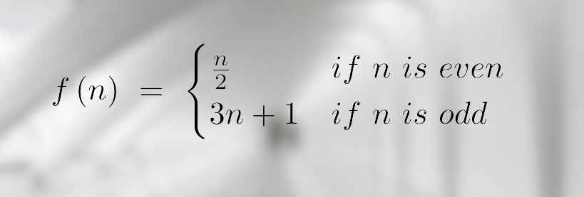
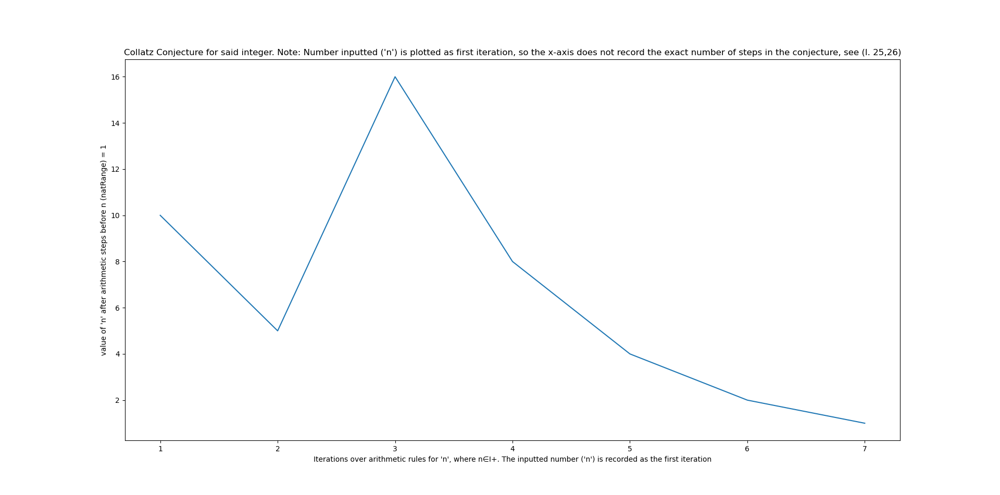
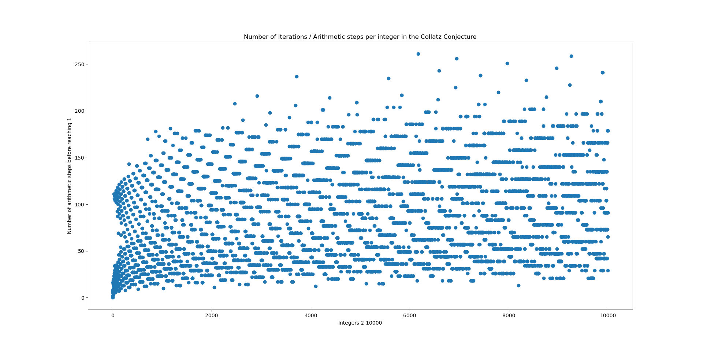

# The Collatz Conjecture

@JaskaranSingh2

## What is this?  

These are two basic python programs dedicated to the famous conjecture that's called the 'Collatz Conjecture,' or sometimes '3n+1.' The first program, 'CollatzTest.py' allows anyone to input any positive integer and look at the 'hailstone numbers' formed in the sequence. The second program, 'CollatzCompileVis.py' looks at the stopping time for each individual sequence in terms of arithmetic steps over 9999 integers (It looks over 1, so technically 10000) and forms a really interesting pattern. Both of these programs utilize 'matplotlib' for graphing.

## What are the basic rules for the conjecture?

## Well, what does this all mean?

In layman’s terms, the "Collatz Conjecture," by mathematician Lothar Collatz suggests that repeating these two arithmetic operations for every positive integer (represented by 'n') will always lead the sequences back to the number 1.

## The Procedure

It works like this: if the positive integer is even, divide by 2, if it is odd, put it through the expression 3n+1. This all leads back to the number 1

## Images

##### CollatzTest.py: 

For '10':  

##### CollatzCompileVis.py:

